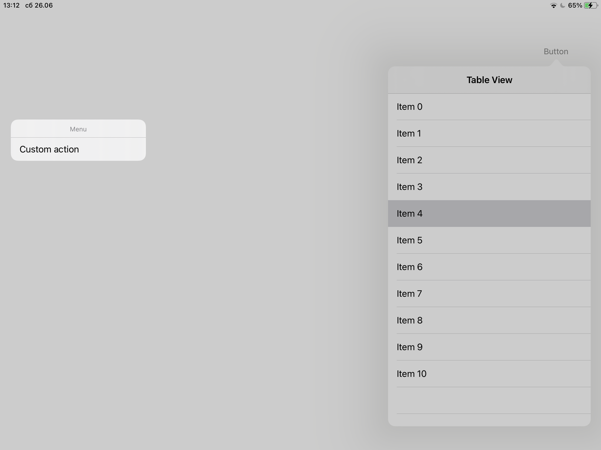

# Glitches with UIContextMenu and Drag and Drop

This minimal example contains one button, that when pressed, opens a popover with a `UITableView`. Rows in the table view are reorderable (enabled  with `tableView.dragInteractionEnabled`, `.dragDelegate`, and `.dropDelegate`), and each row opens a context menu.

Sometimes, the context menu or the row being dragged appears in the wrong location on the screen, as seen in the video recording (`./screenrecording.MP4`) and screenshot (`./screenshot.PNG`) included in this repository. I haven't figured out what exactly triggers this, it seems to happen after a previous interaction, when some animations are still ocurring.



When the row / menu appears in the wrong place, the following message is printed:
```
2021-06-26 13:12:41.980276+0300 contextmenutest[722:88127] [Assert] Presenting while the highlight platter isn't in a window.
```

